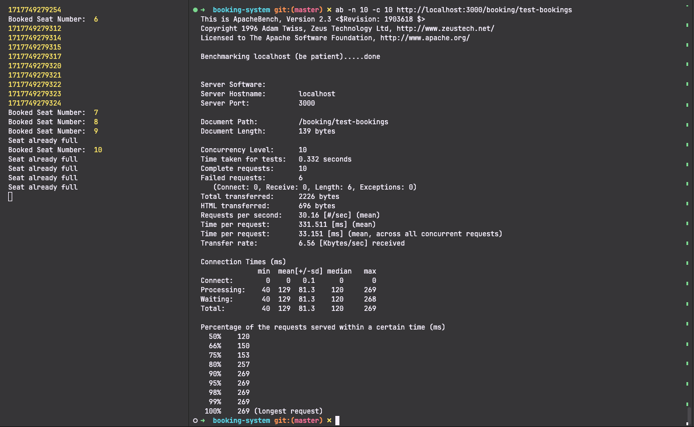
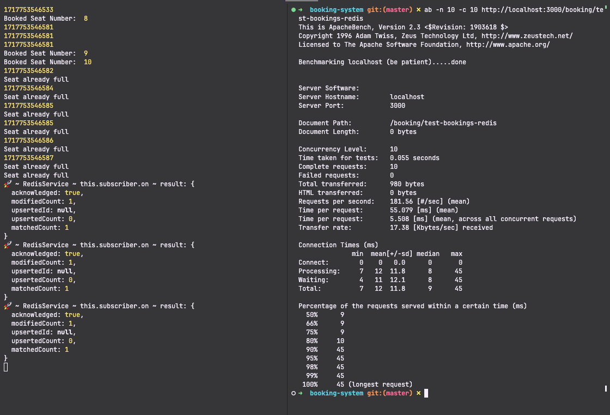

## Giả thuyết đơn giản hoá hệ thống: 
- Bỏ qua authen, author và chỉ cần tên để đặt hàng
- Coi đặt hàng là đã thanh toán (bỏ qua thanh toán).
- Mỗi ghế có sức chứa là 10 (tối đa 10 lần đặt)
- Mỗi lần đặt 1 seat

## Vấn đề giải quyết: 
- Nhiều user đặt seats cùng một thời điểm
- Xem thông tin seats của một room 
- Tạo Room
- Tạo Seat (theo room)

## Giải pháp: 
1.  Sử dụng tính nguyên tử - Atomic trong mongodb.
2. Sử dụng Redis để kiểm tra việc order có hợp lệ hay không và sử dụng redis pub-sub để tăng giảm capacity của đơn hàng sau đó.

## Cách tạo nhiều request truy cập tại cùng một thời điểm: 
- Sử dụng ap - [Apache HTTP server benchmarking tool](https://httpd.apache.org/docs/2.4/en/programs/ab.html) để mô phỏng nhiều request tại cùng một thời điểm
- Việc sử dụng Promise.all cũng tương tự

## Phân tích

```typescript
class SeatEntity {
  id: string;
  name: string;
  type: SeatType;
  room_id: string;
  status: SeatStatus;
  capacity: number;
}
 class RoomEntity {
  id: string;
  name: string;
}
Booking {} 

```


## Kết quả
- Rất khó để thực hiện tạo request cùng một timestamp (kết quả test bằng Promise.all cũng không được chính xác 100%)

### Sử dụng hàm [findOneAndUpdate](https://mongoosejs.com/docs/tutorials/findoneandupdate.html#:~:text=%3B%20//%2059-,Atomic%20Updates,-With%20the%20exception)



### Sử dụng Redis để kiểm soát việc đặt hàng
=> Kết luận: ở trường hợp chạy này, may mắn là có 3 request đến tại thời điểm: **1717753546581** để cho chúng ta thấy được khả năng kiểm soát số lượng khi có nhiều request đến tại cùng một thời điểm - tuy nhiên số lượng đặt seat tối đa vẫn là 10.



## How to run this code
```typescript
1. clone source code
2. pnpm i (or yarn install || npm install)
3. create .env.local with the following environment variables
MONGO_URI=
REDIS_HOST=
REDIS_PORT=
REDIS_PASSWORD=
4. npm run local || pnpm run local || yarn run local
5. api documents: http://localhost:3000/docs
```

#### ab command

ab --h for more information

```
ab -n 10 -c 10 http://localhost:3000/booking/test-bookings
ab -n 10 -c 10 http://localhost:3000/booking/test-bookings-redis
```